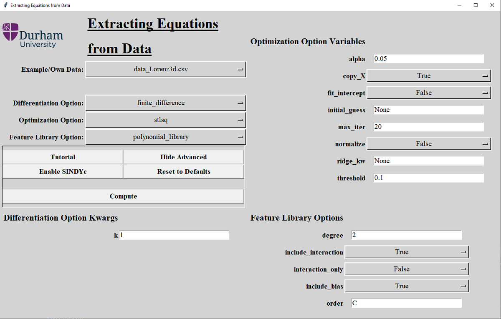
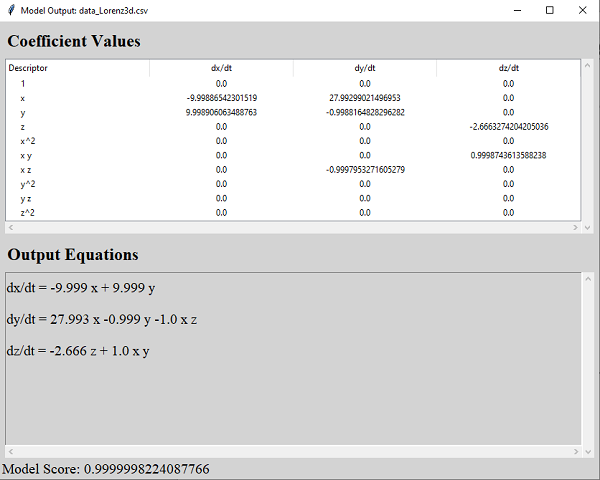
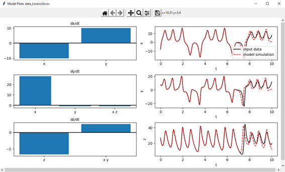

# SEED

**SEED**: **S**oftware for the **E**xtraction of **E**quations from **D**ata

## Table of contents
* [Introduction](#introduction)
* [Getting Started](#getting-started)
	* [Installing](#installing)
* [Usage](#usage)
	* [Running SEED](#running-SEED)
	* [Using your own data](#using-your-own-data)
* [Model Output](#model-output)
	* [Examples](#examples)
		* [3D Lorenz System](#3d-lorenz-system)
		* [5D Random System](#5d-random-system)
		* [Predator Prey Model](#predator-prey-model)

## Introduction
SEED is a package written in Python that allows for the extraction of governing differential equations from data. It has been written with use of the [PySINDy](https://github.com/dynamicslab/pysindy) package, written by Brian de Silva et al.

SEED has a simple and intuitive Graphical User Interface (GUI) so that researchers in a wide variety of fields, without needing to know any programming, can analyse their data using these cutting edge methods.

## Getting Started

### Installing
Currently, SEED has been tested on Mac and Windows. Although it may be able to run on other operating systems, results may vary. For previous iterations, please refer to [SEED 2.0](https://github.com/Statistical-Learning-4-System-Id/SEED2.0), created by Michael Vause.

In order to install SEED, simply download the files and extract the contents of the zipped download to a desired folder. 

* Python:

In order to run SEED, the user must have a current Python installation, that can be downloaded from the [Python website](https://www.python.org/downloads/). If running SEED on a Windows system, ensure to select the add python to path option during installation.

As well as the base Python installation, it is vital to install the Python modules needed for the programme to run. You can do this by running these commands in the terminal or command line:

* Windows - command line:

> _python -m pip install matplotlib pysindy pandas_

* Mac - terminal

> _python3 -m pip install matplotlib pysindy pandas_

## Usage

### Running SEED

To run SEED, open a Python IDE (there is one included with the Python download) and open the SEED.py file. Run the file from the IDE toolbar.

The GUI will start up and will look like this:

* Windows:

* Mac (old):

From here, the data to be analysed can be selected from the “Example/Own Data” dropdown. Differentiation, optimisation, and feature library options can be edited by using the “Show Advanced” button, which shows the full GUI:

Check the [PySINDy](https://github.com/dynamicslab/pysindy) GitHub repository for details on the optimization, differentiation and feature library options.

### Using your own data
In order to use your own data with SEED, you must save the data as a _.csv_ file with one column of time series data, and further columns containing the data for each recorded variable. The first row of your _.csv_ file must be the names of each variable.  
An example of a three variable system is shown below:

There are two ways to run the program with your own data files.

The first is to select _Own Data_ in the _Example/Own Data_ dropdown selection box on the main panel of the GUI, then using the file browser, you can then select the file containing your data.

You can also save the data file in the data folder containing the example data files that came with the SEED download, then select it in the dropdown after running SEED.

## Model Output

After pressing the _Compute_ button, SEED uses the selected _Differentiation_, _Optimization_ and _Feature Library_ Options to create a PySINDy model with the selected data. Two output windows will be shown. 

The first window shows the output sparse coefficents in a table and the output equations of the system, as well as the overall model score:

The second window shows two sets of plots comparing the coefficients in a bar graph and modelling the predicted model versus the input data:

These windows show the output of the Lorenz System example described below:

### Examples
There are three datasets which come as a part of the download:

* 3D Lorenz System
* 5D Random Data
* Predator-Prey Model (with and without forcing)

#### 3D Lorenz System

This first example (data_Lorenz3d.csv) contains the data for a three-dimensional Lorenz System, generated from the [feature overview](https://github.com/dynamicslab/pysindy/blob/master/examples/1_feature_overview.ipynb) example file from the [PySINDy](https://github.com/dynamicslab/pysindy) GitHub repository. 

In short, the data is generated by simulating the following governing equations:

> d**x** / dt = σ(**y** - **x**),
> 
> d**y** / dt = **x**(ρ - **z**) - **y**,
> 
> d**z** / dt = **xy** - β**z**,

where σ, ρ and β are constants with their typical values of 10, 8/3, and 28 respectively. The system's initial conditions are:

> **x**(0) = 1,
>
> **y**(0) = 1,
>
> **z**(0) = 1.

The ability to generate your own dataset is also built into the program. Just select the _Generate Lorenz Data_ option in the _Example/ Own Data_ dropdown menu. After pressing compute, a window will pop up containing the inital Lorenz conditions of the _data\_Lorenz3d.csv_ data. You can then edit the conditions to generate your own system. After pressing _Continue_, SEED will generate the system, and compute its output.

#### 5D Random System
This dataset (random_5d.csv) aims to show an output where there are no governing equations generating the data, and PySINDy will not be able to find sensible coefficient values in this case. 

#### Predator Prey Model
The two data sets (predpreyunforced.csv and predatorpreydata.csv) demonstrate the SINDy with Control (SINDYc) method. The unforced data is generated using the governing equations:

> d**x** / dt = a**x** - c**xy**,
>
> d**y** / dt = -b**y** + d**xy**,

where **x** is the number of prey in the system, **y** is the number of predators in the system, and (a,b,c,d) are constants linked to the natural reproduction and decline of the species and the effect on both populations due to predation, respectively. The system has been simulated with some default values for 600 time steps of 0.1 to generate the dataset.

To demonstrate the usage of SINDy with Control (SINDYc), the same system has then been simulated with the addition of a forcing function **u**:

> **u**(t) = 2 sin(t) + 2 sin(0.1t),

which is input with the rate of change of prey as:

> d**x** / dt = a**x** - c**xy** + **u**^2.

By toggling the _Enable SINDYc_ button, SEED will attempt to identify how the system is forced from the data. It is important to note that input data with SINDYc must be of the format (in column order, from left to right) - time_series, state space data (e.g. x,y,z), forcing function.

## Current and Future Development

**DONE**
* Lasso Optimisation
* Derivative Package Support

**IN PROGRESS**
* Custom Feature Library
* Unit Testing
* General Tidying and Moving to Base Library and Main
* SINDYc Implementation

**POSSIBLE DEVELOPMENT**
* Analysing Noise Rejection and Model Scoring
