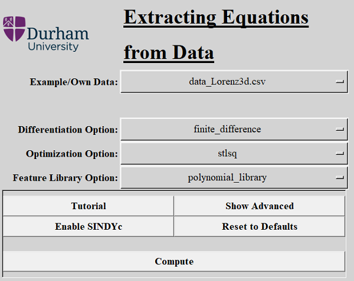
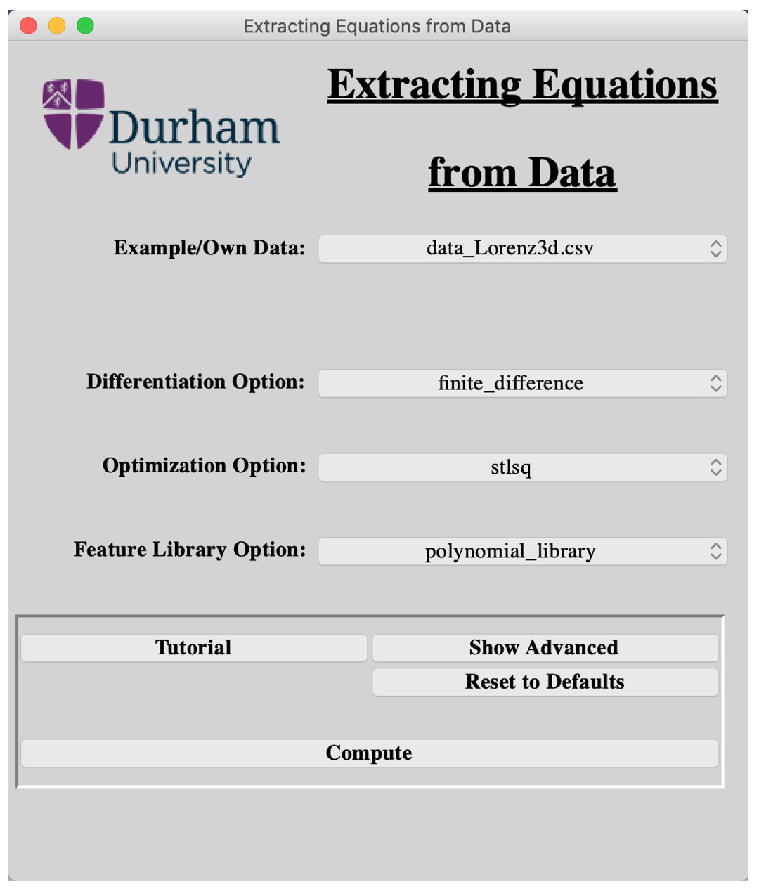
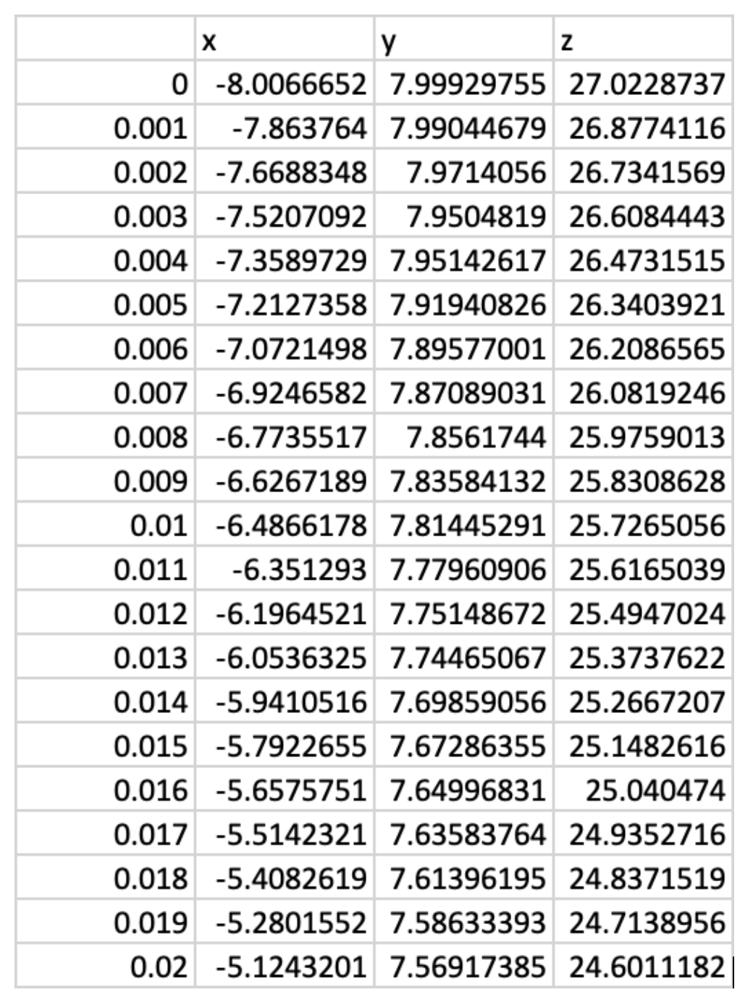
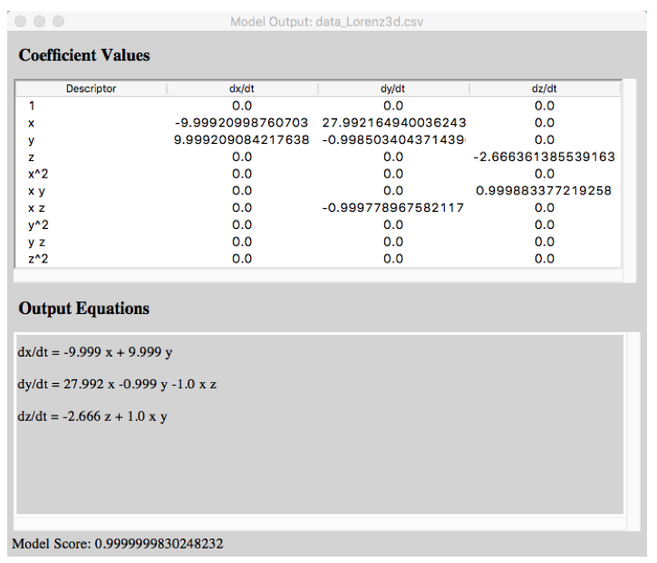

# SEED 3

**SEED**: **S**oftware for the **E**xtraction of **E**quations from **D**ata

## Table of contents
* [Introduction](#introduction)
* [Getting Started](#getting-started)
	* [Installing](#installing)
* [Usage](#usage)
	* [Running SEED 3](#running-SEED-3)
	* [Examples](#examples)
	* [Using your own data](#using-your-own-data)
* [Model Output](#model-output)

## Introduction
SEED 3 is a package written in Python that allows for the extraction of governing differential equations from data. It has been written with use of the [PySINDy](https://github.com/dynamicslab/pysindy) package, written by Brian de Silva et al.

SEED 3 has a simple and intuitive Graphical User Interface (GUI) so that researchers in a wide variety of fields, without needing to know any programming, can analyse their data using these cutting edge methods.

## Getting Started

### Installing
Currently, SEED 3 has only been tested on Windows. Although it may be able to run on other operating systems, results may vary. For previous iterations which have been tested on Mac, please refer to [SEED 2.0](https://github.com/Statistical-Learning-4-System-Id/SEED2.0), created by Michael Vause.

First, download the files from the SEED GitHub page. Press the green _Code_ button on the top left and download zip. When downloaded, unzip the downloaded files. After downloading these source files, save them in the same folder anywhere you would like.

* Python:

In order to run SEED 3, the user must have a current Python installation, that can be downloaded from the [Python website](https://www.python.org/downloads/). If running SEED 3 on a Windows system, ensure to select the add python to path option during installation.

As well as the base Python installation, it is vital to install the Python modules needed for the programme to run. You can do this by running these commands in the terminal or command line:

* Windows - command line:

> _python -m pip install matplotlib pysindy pandas_

## Usage

### Running SEED 3

To run SEED 3 from its files, open the Python IDE (included with the Python download) and open the file _SEED2\_0.py_. Click _Run > Run Module_ on the toolbar to run the software.

The GUI will start up and will look like this:

* Windows:

* Mac (old):

After launching, you can then select your data file and press the _Compute_ button to obtain your output equations.

Check the [PySINDy](https://github.com/dynamicslab/pysindy) GitHub repository for details on the optimization, differentiation and feature library options.

### Examples
There are two datasets that come with the download.

The first, called _data\_Lorenz3d.csv_, contains the data for a three dimensional lorenz system, generated from the [feature overview](https://github.com/dynamicslab/pysindy/blob/master/examples/1_feature_overview.ipynb) example file from the [PySINDy](https://github.com/dynamicslab/pysindy) GitHub repository. 

The second, called _random\_5d.csv_, contains five variables of randomly generated data. This is to show an example of the output of SEED 3 when a system with no underlying relationship is tested. It is clear that the SINDy algorithm can't settle on sparse coefficients to represent the model.

The ability to generate your own dataset is also built into the program. Just select the _Generate Lorenz Data_ option in the _Example/ Own Data_ dropdown menu. After pressing compute, a window will pop up containing the inital Lorenz conditions of the _data\_Lorenz3d.csv_ data. You can then edit the conditions to generate your own system. After pressing _Continue_, SEED 3 will generate the system, and compute its output.

### Using your own data
In order to use your own data with SEED 3, you must save the data as a _.csv_ file with one column of time series data, and further columns containing the data for each recorded variable. The first row of your _.csv_ file must be the names of each variable.  
An example of a three variable system is shown below:

There are two ways to run the program with your own data files.

The first is to select _Own Data_ in the _Example/Own Data_ dropdown selection box on the main panel of the GUI, then using the file browser, you can then select the file containing your data.

You can also save the data file in the data folder containing the example data files that came with the SEED 3 download, then select it in the dropdown after running SEED 3.

## Model Output
After pressing compute, SEED 3 uses the selections on the main GUI window to make a PySINDy model using the selected data. The first output window displays the output sparse coefficients in a table, and automatically forms the output equations. It also calculates and displays the model score, an inbuilt feature to PySINDy. An example of this window, on MacOS, can be seen below:

The second output window displays two sets of plots. The first set shows the coefficients for each output equation in bar plots to easily visualise which terms in each equation are more important. The second set of plots shows the selected input data plotted against simulated data, created using the input data's initial conditions, evolved using the model's output equations. This can be seen below:

Pressing the save button on this window saves both a _.png_ of the output plots and a _.csv_ of the output coefficient matrix to the filepath selected.

Both example output windows are the MacOS versions.

## Current and Future Development

**DONE**
* Lasso Optimisation
* Derivative Package Support

**IN PROGRESS**
* Custom Feature Library
* Unit Testing
* General Tidying and Moving to Base Library and Main
* SINDYc Implementation

**POSSIBLE DEVELOPMENT**
* Analysing Noise Rejection and Model Scoring
